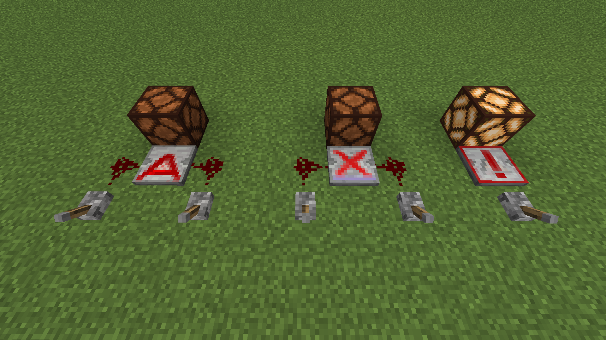
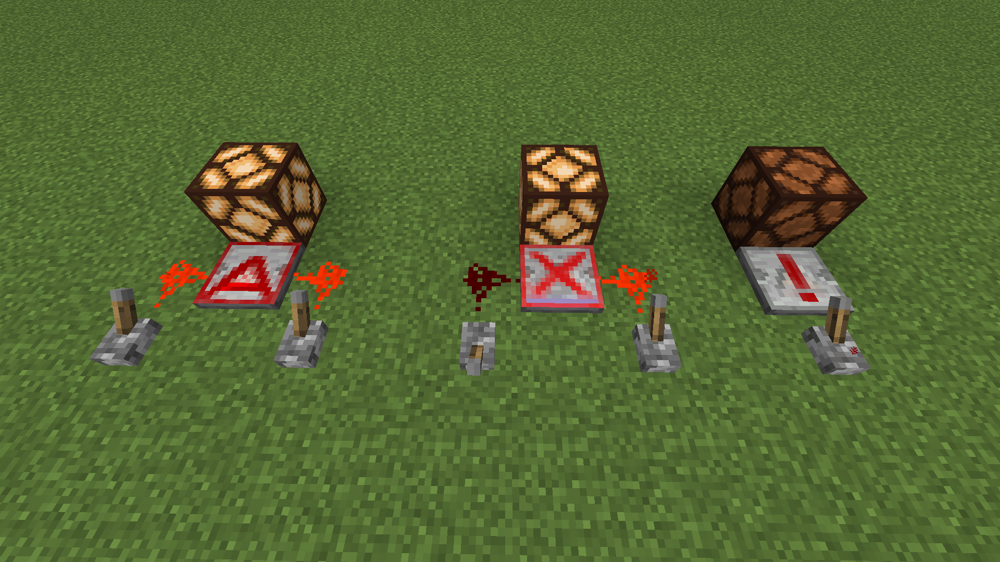

# BitwiseMC
## This mod adds binary AND, XOR, and NOT gates as minecraft diode blocks.

- The AND and XOR gates take redstone input from the left and right sides and output to the top of the block.
- The NOT gate takes redstone input from the back and outputs to the front.
- All gates have a delay of 2 and output 15 power

## Installation
1. Install [Forge](https://files.minecraftforge.net/net/minecraftforge/forge/) (mod is written for v1.18.1).
2. Download the mod [jar](https://drive.google.com/file/d/1CJyDQTDtqwIe00dcrFn_M2d4YEG7_KME/view?usp=sharing) (or build it from source).
3. Add the jar file to the `.minecraft/mods` folder on your computer

## Building from source
From the root directory run `./gradlew runData && ./gradlew build`. Then jar will be generated in `build/libs`.